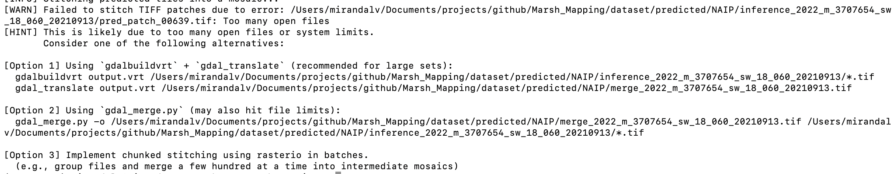

# Marsh Mapping with Sentinel-2 MSI and NAIP imagery with Deep Learning

This post outlines the workflow for mapping tidal marshes using Sentinel-2 multispectral imagery and National Agriculture Imagery Program (NAIP) data. It covers the full process - from data download and preprocessing to model prediction and post-processing of the imagery.

## Setting up the working environment

- For mac and linux user, run this command on terminal:

    `conda env create --file=environment.yml`

For windows user: Please refer conda user guidance to install conda, and create a virtual environment with the .yaml file (https://docs.conda.io/projects/conda/en/latest/user-guide/getting-started.html). 

**For windows user - Recommend:** Download and install Anaconda or Miniconda for Windows. It will add the necessary tools to your system and register the conda command in Anaconda Prompt. Sample prompt to follow: https://chatgpt.com/share/686acab8-b3e4-8004-8335-56d71a7292f6.

- Run this command on terminal to activate the virtual environment:

    `conda activate xxxxx`

## Imagery Acquisition
- **Sentinel-2 data:** Follow this page to download Sentinel multispectral data: https://github.com/MirandaLv/Marsh_Mapping/tree/main/dataset/raw/Sentinel-2.  

- **NAIP:** Follow this page to download NAIP data: https://github.com/MirandaLv/Marsh_Mapping/tree/main/dataset/raw/NAIP. 

## Imagery Preprocessing

### **Sentinel MSI imagery preprocessing from raw:**
1. Converting the raw .jp2 imagery band to .tif
2. Reprojecting individual sentinel band (.tif) to WGS-84, and resampling all bands into standarded 10m resolution.
3. Imagery mosaic if multiple tiles are downloaded.
4. Merging the 10-m bands into a multispectral imagery. 
5. Creating 128 * 128 multispectral imagery patches and saved into 'dataset/sentinel_year/patches' for imagery inferencing.

**Step to run the code for Sentinel data preprocessing:**

- Open the 'preprocessing_sentinel.py' script and update the year and AOI variables. Set the year to match the dataset you want to process, and assign a meaningful location name to the AOI variable.
- Run imagery preprocessing for sentinel data, run:

    python processing/preprocessing_sentinel.py

You will find the preprocessed data under 'dataset/processed/sentinel_yourAOIname_year' folder.

### **NAIP imagery preprocessing from raw:**
1. The NAIP imagery usually is downloaded as .tif file, so there is not much preprocessing needed.
2. Creating 256 * 256 dimension patches for prediction. 

**Step to run the code for NAIP data preprocessing:**

- Open the 'preprocessing_naip.py' script and update the year and the tile name you downloaded from the previous steps. Make sure that the tile exist in the 'dataset/raw/NAIP/{year}' directory.
- Run imagery preprocessing for NAIP data, run:

    python processing/preprocessing_naip.py

You will find a 'tilename_patches' folder under the directory 'dataset/processed/NAIP_{year}' after running the code. 

## Model Inference

### **Model Inference with NAIP Imagery**
Take an imagery tile with a name 'm_3707654_sw_18_060_20210913.tif' acquired from 2022 for example, this is one of the tile that covers your AOI area, this tile should be saved under 'dataset/raw/NAIP/2022' folder. Run below code for marsh detection with a pretrained U-Net model:

    python model/marsh_naip.py --year 2022 --tile-name m_3707654_sw_18_060_20210913

This code executes the marsh_naip.py script located in the model folder. The script reads all image patches generated during the NAIP data preprocessing step, runs model inference on each patch, stitches the predictions into a single output, and saves the result to a specified destination folder.

Please note that if the number of image patches is very large, you may encounter memory-related errors. This typically occurs when the script attempts to open hundreds of .tif files simultaneously, exceeding system memory limits. If such an error arises, refer to the alternative solutions suggested in the terminal output.

Below is an example of the error message you might see: 

Follow the recommended alternative methods to merge the predicted patches into a complete tile-level detection output.

For example, run

    gdal_merge.py -o /Users/mirandalv/Documents/projects/github/Marsh_Mapping/dataset/predicted/NAIP/merge_2022_m_3707654_sw_18_060_20210913.tif /Users/mirandalv/Documents/projects/github/Marsh_Mapping/dataset/predicted/NAIP/inference_2022_m_3707654_sw_18_060_20210913/*.tif

on the terminal, you will get the marsh prediction result saved under 'dataset/predicted/NAIP/merge_2022_m_3707654_sw_18_060_20210913.tif'.

## Image Post-processing

### **Image Post-processing with NAIP Imagery**

To post-process the predictions generated in the previous step for the tile m_3707654_sw_18_060_20210913.tif, open the postprocessing_naip.py script. Ensure that the tile directory and filename are correctly specified for the tile you are working with, then run the script as shown below:

    python processing/postprocessing.py

### To do
- Sentinel metadata retrieval -> .csv (done)
- Sentinel data downloader (done)
- Imagery tile preprocessing (done) 
- Model architecture
- deep learning dataloader
- imagery inference
- stitch back to original data

- Maybe add a NAIP feature to the code;
