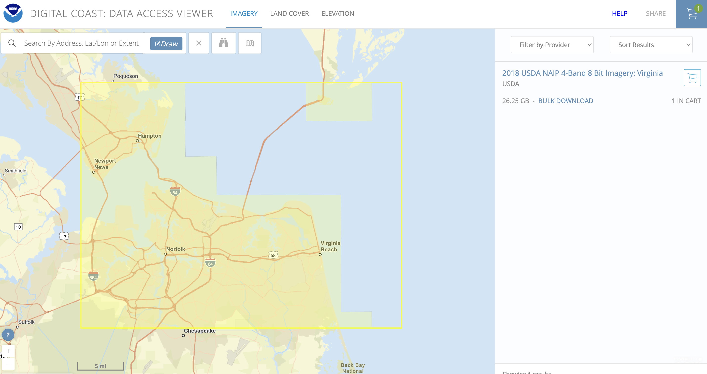

# National Agricultural Imagery Program (NAIP) data acquisition

The National Agriculture Imagery Program (NAIP) is a U.S. Department of Agriculture (USDA) initiative that provides high-resolution aerial imagery of the continental United States. Captured during the agricultural growing seasons, NAIP imagery has a spatial resolution of 1 meter and typically includes Red, Green, Blue (RGB), and Near-Infrared (NIR) bands. The imagery recently published have spatial resolution of 0.6 meter. The imagery is orthorectified and projected in UTM coordinates, making it suitable for precise spatial analysis. 

NAIP data is publicly available and commonly used for land cover classification, vegetation monitoring, wetland mapping, and urban development assessment. Each U.S. state is generally imaged every 2–3 years, depending on funding and program priorities. 

The most recent NAIP collected by Virginia in 2021 can be access: https://www.fisheries.noaa.gov/inport/item/69003, the 2018 Virginia NAIP can be access: https://www.fisheries.noaa.gov/inport/item/58386.

Steps to download the recent NAIP tiles, using the 2018 imagery as an example:

1. Go to: https://www.fisheries.noaa.gov/inport/item/58386
2. Click the Customized Download on this page, it will take you to the Digital coast: Data Access Viewer. .
3. Zoom to the ROI area on the map viewer, and draw a polygon on the viewer.
4. Adding the data into the order cart. .
5. Following the steps to place the order of the imagery.

**Another way to download the imagery:**
1. On the above page, instead of adding the imagery into the cart, click the Bulk Download.
2. This will navigate you to the metadata page of all the 2018 NAIP Virginia: https://coastalimagery.blob.core.windows.net/digitalcoast/VA_NAIP_2018_8977/index.html
3. Download the 'tileindex_VA_NAIP_2018.zip' under Meta Info .
4. The 'tileindex_VA_NAIP_2018' is a shapefile of all the tile index. .
5. Click the tile/tiles that cover your AOI, and find the download links for each tiles in the Attribute table.
6. Save the downloaded NAIP imagery tiles under 'dataset/raw/NAIP/2018' folder for futher data processing.

