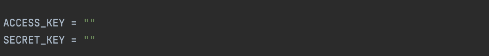

# Sentinel multispectral imagery acquisition with Copernicus Data Space Ecosystem

Sentinel-2 is a satellite mission developed by the European Space Agency (ESA) as part of the Copernicus Program, designed for Earth observation and environmental monitoring. The mission consists of two satellites, Sentinel-2A and Sentinel-2B, which together provide global coverage every 5 days at the equator. Sentinel-2 captures high-resolution, multispectral imagery across 13 spectral bands ranging from visible and near-infrared (VNIR) to shortwave infrared (SWIR), with spatial resolutions of 10, 20, and 60 meters depending on the band.

Sentinel-2 imagery is particularly well-suited for monitoring vegetation health, land use and land cover change, coastal and inland water bodies, and natural disasters like floods or wildfires. Its open-access data policy and consistent, high-quality observations make it widely used in research, environmental management, and operational applications around the world. The imagery is available through various platforms, including Copernicus Data Space Ecosystem, Google Earth Engine, and AWS Open Data Registry.

The Copernicus Open Access Hub (SciHub) was deprecated in 2023, thus a more convenient way to access the sentinel data is through the Copernicus Data Space Ecosystem. 

**Steps for getting Sentinel data**

1. Follow this link (https://documentation.dataspace.copernicus.eu/APIs/S3.html) to create a CDSE account, and getting the ACCESS KEY and SECRET KEY to access data saved on S3.
2. Open the python file 'sentinel_downloader.py' in your python file editor under the 'sentinel' folder.
3. Replace the ACCESS KEY and SECRET KEY variables with your CDSE credential..
4. There are a few variables to adjust based on your need, for example, the maximum percentage of cloud cover 'MAX_CLOUD_COVER' allowed in your imagery filter, START_DATE and END_DATE for when was the imagery collected, the AOI_PATH is the .geojson or .shapefile boundary of your AOI.
5. The sentinel_downloader.py script retrieves available Sentinel imagery that overlaps with your area of interest (AOI) based on specified filter criteria.
6. A series of matching tiles that intersect the study area will be downloaded. For larger areas, multiple tiles meeting the specified criteria (e.g., cloud coverage, acquisition time) may be retrieved. When multiple tiles cover the same area and meet all criteria, the selection will be based on the lowest cloud coverage.
7. Run this code on terminal, to download the sentinel imagery: 

    `python sentinel_downloader.py`